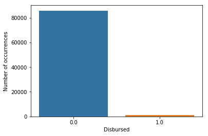
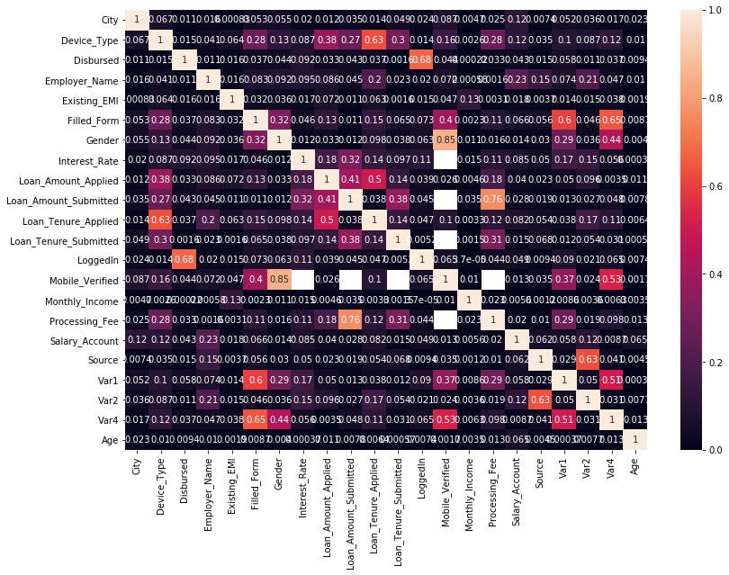

# Happy Customer Bank目标客户（贷款成功的客户）识别

利用LightGBM/XGboost实现Happy Customer Bank目标客户（贷款成功的客户）识别


一、	任务说明：Happy Customer Bank目标客户识别
https://discuss.analyticsvidhya.com/t/hackathon-3-x-predict-customer-worth-for-happy-customer-bank/3802


```python
# 首先 import 必要的模块
import pandas as pd 
import numpy as np

import matplotlib.pyplot as plt
import seaborn as sns
%matplotlib inline
```

## 读取数据


```python
# 读取数据
train = pd.read_csv('Train.csv')
test = pd.read_csv('Test.csv')
train.head(5)
test.head(5)
```

    d:\ProgramData\Anaconda3\lib\site-packages\IPython\core\interactiveshell.py:3020: DtypeWarning: Columns (12,18) have mixed types. Specify dtype option on import or set low_memory=False.
      interactivity=interactivity, compiler=compiler, result=result)


<div>
<style scoped>
    .dataframe tbody tr th:only-of-type {
        vertical-align: middle;
    }

    .dataframe tbody tr th {
        vertical-align: top;
    }

    .dataframe thead th {
        text-align: right;
    }
</style>
<table border="1" class="dataframe">
  <thead>
    <tr style="text-align: right;">
      <th></th>
      <th>ID</th>
      <th>Gender</th>
      <th>City</th>
      <th>Monthly_Income</th>
      <th>DOB</th>
      <th>Lead_Creation_Date</th>
      <th>Loan_Amount_Applied</th>
      <th>Loan_Tenure_Applied</th>
      <th>Existing_EMI</th>
      <th>Employer_Name</th>
      <th>...</th>
      <th>Loan_Amount_Submitted</th>
      <th>Loan_Tenure_Submitted</th>
      <th>Interest_Rate</th>
      <th>Processing_Fee</th>
      <th>EMI_Loan_Submitted</th>
      <th>Filled_Form</th>
      <th>Device_Type</th>
      <th>Var2</th>
      <th>Source</th>
      <th>Var4</th>
    </tr>
  </thead>
  <tbody>
    <tr>
      <th>0</th>
      <td>ID000026A10</td>
      <td>Male</td>
      <td>Dehradun</td>
      <td>21500</td>
      <td>03-Apr-87</td>
      <td>05-May-15</td>
      <td>100000.0</td>
      <td>3.0</td>
      <td>0.0</td>
      <td>APTARA INC</td>
      <td>...</td>
      <td>100000.0</td>
      <td>3.0</td>
      <td>20.0</td>
      <td>1000.0</td>
      <td>2649.39</td>
      <td>N</td>
      <td>Web-browser</td>
      <td>B</td>
      <td>S122</td>
      <td>3</td>
    </tr>
    <tr>
      <th>1</th>
      <td>ID000054C40</td>
      <td>Male</td>
      <td>Mumbai</td>
      <td>42000</td>
      <td>12-May-80</td>
      <td>01-May-15</td>
      <td>0.0</td>
      <td>0.0</td>
      <td>0.0</td>
      <td>ATUL LTD</td>
      <td>...</td>
      <td>690000.0</td>
      <td>5.0</td>
      <td>24.0</td>
      <td>13800.0</td>
      <td>19849.90</td>
      <td>Y</td>
      <td>Mobile</td>
      <td>C</td>
      <td>S133</td>
      <td>5</td>
    </tr>
    <tr>
      <th>2</th>
      <td>ID000066O10</td>
      <td>Female</td>
      <td>Jaipur</td>
      <td>10000</td>
      <td>19-Sep-89</td>
      <td>01-May-15</td>
      <td>300000.0</td>
      <td>2.0</td>
      <td>0.0</td>
      <td>SHAREKHAN PVT LTD</td>
      <td>...</td>
      <td>NaN</td>
      <td>NaN</td>
      <td>NaN</td>
      <td>NaN</td>
      <td>NaN</td>
      <td>N</td>
      <td>Web-browser</td>
      <td>B</td>
      <td>S133</td>
      <td>1</td>
    </tr>
    <tr>
      <th>3</th>
      <td>ID000110G00</td>
      <td>Female</td>
      <td>Chennai</td>
      <td>14650</td>
      <td>15-Aug-91</td>
      <td>01-May-15</td>
      <td>0.0</td>
      <td>0.0</td>
      <td>0.0</td>
      <td>MAERSK GLOBAL SERVICE CENTRES</td>
      <td>...</td>
      <td>NaN</td>
      <td>NaN</td>
      <td>NaN</td>
      <td>NaN</td>
      <td>NaN</td>
      <td>N</td>
      <td>Mobile</td>
      <td>C</td>
      <td>S133</td>
      <td>1</td>
    </tr>
    <tr>
      <th>4</th>
      <td>ID000113J30</td>
      <td>Male</td>
      <td>Chennai</td>
      <td>23400</td>
      <td>22-Jul-87</td>
      <td>01-May-15</td>
      <td>100000.0</td>
      <td>1.0</td>
      <td>5000.0</td>
      <td>SCHAWK</td>
      <td>...</td>
      <td>100000.0</td>
      <td>2.0</td>
      <td>NaN</td>
      <td>NaN</td>
      <td>NaN</td>
      <td>N</td>
      <td>Web-browser</td>
      <td>B</td>
      <td>S143</td>
      <td>1</td>
    </tr>
  </tbody>
</table>
<p>5 rows × 24 columns</p>
</div>


```python
train.info()
```

    <class 'pandas.core.frame.DataFrame'>
    RangeIndex: 87020 entries, 0 to 87019
    Data columns (total 26 columns):
    ID                       87020 non-null object
    Gender                   87020 non-null object
    City                     86017 non-null object
    Monthly_Income           87020 non-null int64
    DOB                      87020 non-null object
    Lead_Creation_Date       87020 non-null object
    Loan_Amount_Applied      86949 non-null float64
    Loan_Tenure_Applied      86949 non-null float64
    Existing_EMI             86949 non-null float64
    Employer_Name            86949 non-null object
    Salary_Account           75256 non-null object
    Mobile_Verified          87020 non-null object
    Var5                     87020 non-null object
    Var1                     87019 non-null object
    Loan_Amount_Submitted    52407 non-null float64
    Loan_Tenure_Submitted    52407 non-null float64
    Interest_Rate            27726 non-null float64
    Processing_Fee           27420 non-null float64
    EMI_Loan_Submitted       27727 non-null object
    Filled_Form              87020 non-null object
    Device_Type              87020 non-null object
    Var2                     87020 non-null object
    Source                   87020 non-null object
    Var4                     87020 non-null int64
    LoggedIn                 87020 non-null int64
    Disbursed                87019 non-null float64
    dtypes: float64(8), int64(3), object(15)
    memory usage: 17.3+ MB


```python
## 各属性的统计特性
train.describe()
```


<div>
<style scoped>
    .dataframe tbody tr th:only-of-type {
        vertical-align: middle;
    }

    .dataframe tbody tr th {
        vertical-align: top;
    }

    .dataframe thead th {
        text-align: right;
    }
</style>
<table border="1" class="dataframe">
  <thead>
    <tr style="text-align: right;">
      <th></th>
      <th>Monthly_Income</th>
      <th>Loan_Amount_Applied</th>
      <th>Loan_Tenure_Applied</th>
      <th>Existing_EMI</th>
      <th>Loan_Amount_Submitted</th>
      <th>Loan_Tenure_Submitted</th>
      <th>Interest_Rate</th>
      <th>Processing_Fee</th>
      <th>Var4</th>
      <th>LoggedIn</th>
      <th>Disbursed</th>
    </tr>
  </thead>
  <tbody>
    <tr>
      <th>count</th>
      <td>8.702000e+04</td>
      <td>8.694900e+04</td>
      <td>86949.000000</td>
      <td>8.694900e+04</td>
      <td>5.240700e+04</td>
      <td>52407.000000</td>
      <td>27726.000000</td>
      <td>27420.000000</td>
      <td>87020.000000</td>
      <td>87020.000000</td>
      <td>87019.000000</td>
    </tr>
    <tr>
      <th>mean</th>
      <td>5.884997e+04</td>
      <td>2.302507e+05</td>
      <td>2.131399</td>
      <td>3.696228e+03</td>
      <td>3.950106e+05</td>
      <td>3.891369</td>
      <td>19.197474</td>
      <td>5131.150839</td>
      <td>2.949793</td>
      <td>0.029350</td>
      <td>0.014629</td>
    </tr>
    <tr>
      <th>std</th>
      <td>2.177511e+06</td>
      <td>3.542068e+05</td>
      <td>2.014193</td>
      <td>3.981021e+04</td>
      <td>3.082481e+05</td>
      <td>1.165359</td>
      <td>5.834213</td>
      <td>4725.837644</td>
      <td>1.697736</td>
      <td>0.168785</td>
      <td>0.120063</td>
    </tr>
    <tr>
      <th>min</th>
      <td>0.000000e+00</td>
      <td>0.000000e+00</td>
      <td>0.000000</td>
      <td>0.000000e+00</td>
      <td>5.000000e+04</td>
      <td>1.000000</td>
      <td>11.990000</td>
      <td>200.000000</td>
      <td>0.000000</td>
      <td>0.000000</td>
      <td>0.000000</td>
    </tr>
    <tr>
      <th>25%</th>
      <td>1.650000e+04</td>
      <td>0.000000e+00</td>
      <td>0.000000</td>
      <td>0.000000e+00</td>
      <td>2.000000e+05</td>
      <td>3.000000</td>
      <td>15.250000</td>
      <td>2000.000000</td>
      <td>1.000000</td>
      <td>0.000000</td>
      <td>0.000000</td>
    </tr>
    <tr>
      <th>50%</th>
      <td>2.500000e+04</td>
      <td>1.000000e+05</td>
      <td>2.000000</td>
      <td>0.000000e+00</td>
      <td>3.000000e+05</td>
      <td>4.000000</td>
      <td>18.000000</td>
      <td>4000.000000</td>
      <td>3.000000</td>
      <td>0.000000</td>
      <td>0.000000</td>
    </tr>
    <tr>
      <th>75%</th>
      <td>4.000000e+04</td>
      <td>3.000000e+05</td>
      <td>4.000000</td>
      <td>3.500000e+03</td>
      <td>5.000000e+05</td>
      <td>5.000000</td>
      <td>20.000000</td>
      <td>6250.000000</td>
      <td>5.000000</td>
      <td>0.000000</td>
      <td>0.000000</td>
    </tr>
    <tr>
      <th>max</th>
      <td>4.445544e+08</td>
      <td>1.000000e+07</td>
      <td>10.000000</td>
      <td>1.000000e+07</td>
      <td>3.000000e+06</td>
      <td>6.000000</td>
      <td>37.000000</td>
      <td>50000.000000</td>
      <td>7.000000</td>
      <td>1.000000</td>
      <td>1.000000</td>
    </tr>
  </tbody>
</table>
</div>


# 标签的分布


```python
# Target 分布，看看各类样本分布是否均衡
# Target 分布，两类样本分布严重不均衡，只有1.4%的样本Disbursed为1
sns.countplot(train['Disbursed']);
plt.xlabel('Disbursed');
plt.ylabel('Number of occurrences');
```





发现数据严重不均衡


```python
#合成一个总的data，方便一起做特征工程
train['source']= 'train'
test['source'] = 'test'
data = pd.concat([train, test],ignore_index=True)
data.shape
```

    d:\ProgramData\Anaconda3\lib\site-packages\ipykernel_launcher.py:4: FutureWarning: Sorting because non-concatenation axis is not aligned. A future version
    of pandas will change to not sort by default.
    
    To accept the future behavior, pass 'sort=False'.
    
    To retain the current behavior and silence the warning, pass 'sort=True'.
    
      after removing the cwd from sys.path.


    (124737, 27)


### 检查数据质量：异常点、缺省值


```python
data.apply(lambda x: sum(x.isnull()))
```


    City                      1401
    DOB                          0
    Device_Type                  0
    Disbursed                37718
    EMI_Loan_Submitted       84900
    Employer_Name              113
    Existing_EMI               111
    Filled_Form                  0
    Gender                       0
    ID                           0
    Interest_Rate            84901
    Lead_Creation_Date           0
    Loan_Amount_Applied        111
    Loan_Amount_Submitted    49535
    Loan_Tenure_Applied        111
    Loan_Tenure_Submitted    49535
    LoggedIn                 37717
    Mobile_Verified              0
    Monthly_Income               0
    Processing_Fee           85346
    Salary_Account           16801
    Source                       0
    Var1                         1
    Var2                         0
    Var4                         0
    Var5                         0
    source                       0
    dtype: int64


```python
cat_features = ['Gender','City','Employer_Name','Salary_Account','Mobile_Verified','Var1','Filled_Form','Device_Type','Var2','Source','Var4']
#图太多，还是显示文字
#for col in cat_features:
# col= cat_features[0]
# sns.countplot(train[col]);
# plt.xlabel(col);
# plt.ylabel('Number of occurrences');
# col= cat_features[1]
# sns.countplot(train[col]);
# plt.xlabel(col);
# plt.ylabel('Number of occurrences');
for col in cat_features:
    num_vlaules = len(data[col].unique())
    print('\n%s属性有%d的不同取值，各取值及其出现的次数\n'% (col,num_vlaules))
    print(data[col].value_counts())
```

    
    Gender属性有2的不同取值，各取值及其出现的次数
    
    Male      71398
    Female    53339
    Name: Gender, dtype: int64
    
    City属性有724的不同取值，各取值及其出现的次数
    
    Delhi                  17936
    Bengaluru              15522
    Mumbai                 15425
    Hyderabad              10410
    Chennai                 9895
    Pune                    7427
    Kolkata                 4282
    Ahmedabad               2528
    Jaipur                  1892
    Gurgaon                 1743
    Coimbatore              1659
    Thane                   1306
    Chandigarh              1266
    Surat                   1149
    Visakhapatnam           1080
    Indore                  1051
    Vadodara                 893
    Nagpur                   879
    Lucknow                  813
    Ghaziabad                795
    Bhopal                   735
    Kochi                    692
    Patna                    675
    Faridabad                651
    Noida                    549
    Madurai                  534
    Gautam Buddha Nagar      485
    Dehradun                 444
    Raipur                   430
    Bhubaneswar              407
                           ...  
    Khagaria                   1
    Latehar                    1
    Karim Ganj                 1
    Champhai                   1
    RADHANPUR                  1
    Sawai Madhopur             1
    Bandipore                  1
    Sheikhpura                 1
    North Cachar Hills         1
    Magadh                     1
    Mokokchung                 1
    DHANDHUKA                  1
    Chinnamiram                1
    Tamenglong                 1
    Seoni                      1
    Saiha                      1
    Anjaw                      1
    Mainpuri                   1
    Bageshwar                  1
    Kupwara                    1
    Malkangiri                 1
    Hazaribagh                 1
    SOMNATH JUNAGADHA          1
    SILVASA                    1
    Rudraprayag                1
    Tawang                     1
    Madhepura                  1
    Balrampur                  1
    Haldia                     1
    SILVASSA                   1
    Name: City, Length: 723, dtype: int64
    
    Employer_Name属性有57195的不同取值，各取值及其出现的次数
    
    0                                               6900
    TATA CONSULTANCY SERVICES LTD (TCS)              754
    COGNIZANT TECHNOLOGY SOLUTIONS INDIA PVT LTD     558
    ACCENTURE SERVICES PVT LTD                       476
    GOOGLE                                           408
    ICICI BANK LTD                                   337
    HCL TECHNOLOGIES LTD                             337
    IBM CORPORATION                                  265
    INDIAN AIR FORCE                                 258
    INFOSYS TECHNOLOGIES                             257
    INDIAN ARMY                                      243
    GENPACT                                          240
    WIPRO TECHNOLOGIES                               235
    TYPE SLOWLY FOR AUTO FILL                        219
    IKYA HUMAN CAPITAL SOLUTIONS LTD                 204
    ARMY                                             203
    INDIAN RAILWAY                                   201
    HDFC BANK LTD                                    201
    STATE GOVERNMENT                                 199
    WIPRO BPO                                        186
    INDIAN NAVY                                      183
    CONVERGYS INDIA SERVICES PVT LTD                 165
    OTHERS                                           159
    IBM GLOBAL SERVICES INDIA LTD                    158
    TECH MAHINDRA LTD                                158
    CONCENTRIX DAKSH SERVICES INDIA PVT LTD          154
    CAPGEMINI INDIA PVT LTD                          152
    SERCO BPO PVT LTD                                149
    SUTHERLAND GLOBAL SERVICES PVT LTD               141
    ADECCO INDIA PVT LTD                             140
                                                    ... 
    GARDEN REACH SHIPBULDARS                           1
    RADHEYA MACHINING LTD                              1
    MASPRO NETWORK SOLUTIONS PVT LTD                   1
    COMPUTERLAB                                        1
    SAKSHI EDUCATION AND TRAINING PVT LTD              1
    SOCIETY GENERAL GLOBAL SOLUTIONS                   1
    TV DINESH BABU                                     1
    AMC TEACHER                                        1
    PARMANAND MOHITE                                   1
    PRECISION INFOMATIC                                1
    TOPLINE WRITING INSTRUMENTS PVT LTD                1
    MYNYRA.COM                                         1
    PRIME ELECTRIC LTD                                 1
    FOSM                                               1
    VENKATRAMAN                                        1
    MIN OF RURAL DEVELOPMENT                           1
    RS SOFTWARE INDIA LTD                              1
    TANDSTAD INDIA LTD                                 1
    OFFICE OF THE ACCOUNTANT GENERAL                   1
    UV COLOUR PVT. LTD                                 1
    VHS                                                1
    M PRUDVI RAJU                                      1
    ANIMESH BHATTACHARYA                               1
    KIKABHAI PREMCHAND TRUST AT KING CIRCLE            1
    QUALITY MEDICAL SYSTEM                             1
    LIBERTY SHOES LTD                                  1
    BEST PRODUCTS                                      1
    PRAFUL PATEL                                       1
    BHAVNAGAR DISTRICT CO OP BANK LTD                  1
    AP FIRE SE                                         1
    Name: Employer_Name, Length: 57194, dtype: int64
    
    Salary_Account属性有60的不同取值，各取值及其出现的次数
    
    HDFC Bank                                          25180
    ICICI Bank                                         19547
    State Bank of India                                17110
    Axis Bank                                          12590
    Citibank                                            3398
    Kotak Bank                                          2955
    IDBI Bank                                           2213
    Punjab National Bank                                1747
    Bank of India                                       1713
    Bank of Baroda                                      1675
    Standard Chartered Bank                             1434
    Canara Bank                                         1384
    Union Bank of India                                 1330
    Yes Bank                                            1120
    ING Vysya                                            996
    Corporation bank                                     948
    Indian Overseas Bank                                 901
    State Bank of Hyderabad                              854
    Indian Bank                                          773
    Oriental Bank of Commerce                            761
    IndusInd Bank                                        711
    Andhra Bank                                          706
    Central Bank of India                                648
    Syndicate Bank                                       614
    Bank of Maharasthra                                  576
    HSBC                                                 474
    State Bank of Bikaner & Jaipur                       448
    Karur Vysya Bank                                     435
    State Bank of Mysore                                 385
    Federal Bank                                         377
    Vijaya Bank                                          354
    Allahabad Bank                                       345
    UCO Bank                                             344
    State Bank of Travancore                             333
    Karnataka Bank                                       279
    United Bank of India                                 276
    Dena Bank                                            268
    Saraswat Bank                                        265
    State Bank of Patiala                                263
    South Indian Bank                                    223
    Deutsche Bank                                        176
    Abhyuday Co-op Bank Ltd                              161
    The Ratnakar Bank Ltd                                113
    Tamil Nadu Mercantile Bank                           103
    Punjab & Sind bank                                    84
    J&K Bank                                              78
    Lakshmi Vilas bank                                    69
    Dhanalakshmi Bank Ltd                                 66
    State Bank of Indore                                  32
    Catholic Syrian Bank                                  27
    India Bulls                                           21
    B N P Paribas                                         15
    Firstrand Bank Limited                                11
    GIC Housing Finance Ltd                               10
    Bank of Rajasthan                                      8
    Kerala Gramin Bank                                     4
    Industrial And Commercial Bank Of China Limited        3
    N                                                      1
    Ahmedabad Mercantile Cooperative Bank                  1
    Name: Salary_Account, dtype: int64
    
    Mobile_Verified属性有3的不同取值，各取值及其出现的次数
    
    Y    80928
    N    43808
    0        1
    Name: Mobile_Verified, dtype: int64
    
    Var1属性有20的不同取值，各取值及其出现的次数
    
    HBXX    84900
    HBXC    12952
    HBXB     6502
    HAXA     4214
    HBXA     3042
    HAXB     2879
    HBXD     2818
    HAXC     2171
    HBXH     1387
    HCXF      990
    HAYT      710
    HAVC      570
    HAXM      386
    HCXD      348
    HCYS      318
    HVYS      252
    HAZD      161
    HCXG      114
    HAXF       22
    Name: Var1, dtype: int64
    
    Filled_Form属性有3的不同取值，各取值及其出现的次数
    
    N         96739
    Y         27997
    Mobile        1
    Name: Filled_Form, dtype: int64
    
    Device_Type属性有3的不同取值，各取值及其出现的次数
    
    Web-browser    92105
    Mobile         32631
    G                  1
    Name: Device_Type, dtype: int64
    
    Var2属性有8的不同取值，各取值及其出现的次数
    
    B       53481
    G       47337
    C       20366
    E        1855
    D         918
    F         770
    A           9
    S122        1
    Name: Var2, dtype: int64
    
    Source属性有35的不同取值，各取值及其出现的次数
    
    S122    55248
    S133    42900
    S159     7999
    S143     6140
    S127     2804
    S137     2450
    S134     1900
    S161     1109
    S151     1018
    S157      929
    S153      705
    S144      447
    S156      432
    S158      294
    S123      112
    S141       83
    S162       60
    S124       43
    S150       19
    S160       11
    S136        5
    S155        5
    S138        5
    S139        4
    S129        4
    S135        2
    1           1
    S154        1
    S126        1
    S132        1
    S142        1
    S131        1
    S130        1
    S125        1
    S140        1
    Name: Source, dtype: int64
    
    Var4属性有8的不同取值，各取值及其出现的次数
    
    3    36280
    1    34315
    5    29092
    4     9411
    2     8481
    0     3565
    7     3264
    6      329
    Name: Var4, dtype: int64


```python
cat_features = ['City','Employer_Name','Salary_Account', 'Source']
rare_thresholds = [100, 30, 40, 40]
j=0
for col in cat_features:
    #每个取值的样本数目
    value_counts_col =  data[col].value_counts(dropna=False)

    #样本数目小于阈值的取值为稀有取值
    rare_threshold = rare_thresholds[j]
    value_counts_rare = list(value_counts_col[value_counts_col < rare_threshold ].index)

    #稀有值合并为：others
    rare_index = data[col].isin(value_counts_rare)
    data.loc[ data[col].isin(value_counts_rare), col] = "Others"
    
    j = j+1
```

### City、Employer_Name、Salary_Account、Source
这些特征都是取值很多,
取前几个重要的，其余合并成一个：others

LightGBM对类别特征建立直方图时，当特征取值数目超过max_bin(默认255)，会去掉样本数目少的类别：
统计该特征下每一种离散值出现的次数，并从高到低排序，并过滤掉出现次数较少的特征值, 
然后为每一个特征值，建立一个bin容器, 对于在bin容器内出现次数较少的特征值直接过滤掉，不建立bin容器。

### DOB
DOB是出生的具体日期，具体日期可能没作用，转换成年龄(申请贷款的年龄)


```python
#创建一个年龄的字段Age
data['Age'] = pd.to_datetime(data['Lead_Creation_Date']).dt.year - pd.to_datetime(data['DOB']).dt.year
#data['Age'].head()
#把原始的DOB字段去掉:
data.drop(['DOB', 'Lead_Creation_Date'],axis=1,inplace=True)
```

### Loan Tenure 


```python
#不合理的贷款年限，设为缺失值
data['Loan_Tenure_Applied'].replace([10,6,7,8,9],value = np.nan, inplace = True)
data['Loan_Tenure_Submitted'].replace(6, np.nan, inplace = True)
```

### 类别特征先编码成数值，LightGBM无需One-hot编码


```python
from sklearn.preprocessing import LabelEncoder
le = LabelEncoder()
feats_to_encode = ['City', 'Employer_Name', 'Salary_Account','Device_Type','Filled_Form','Gender','Mobile_Verified','Source','Var1','Var2','Var4']
for col in feats_to_encode:
    data[col] = le.fit_transform(data[col].astype(str))
```

### 发现EMI_Loan_Submitted和Var5特征数据有个别异常值，对其进行处理


```python
data =data.replace("N","NaN")
data =data.replace("HBXX","NaN")

```

## 最终的数据样式


```python
data.head()
```


<div>
<style scoped>
    .dataframe tbody tr th:only-of-type {
        vertical-align: middle;
    }

    .dataframe tbody tr th {
        vertical-align: top;
    }

    .dataframe thead th {
        text-align: right;
    }
</style>
<table border="1" class="dataframe">
  <thead>
    <tr style="text-align: right;">
      <th></th>
      <th>City</th>
      <th>Device_Type</th>
      <th>Disbursed</th>
      <th>EMI_Loan_Submitted</th>
      <th>Employer_Name</th>
      <th>Existing_EMI</th>
      <th>Filled_Form</th>
      <th>Gender</th>
      <th>ID</th>
      <th>Interest_Rate</th>
      <th>...</th>
      <th>Monthly_Income</th>
      <th>Processing_Fee</th>
      <th>Salary_Account</th>
      <th>Source</th>
      <th>Var1</th>
      <th>Var2</th>
      <th>Var4</th>
      <th>Var5</th>
      <th>source</th>
      <th>Age</th>
    </tr>
  </thead>
  <tbody>
    <tr>
      <th>0</th>
      <td>15</td>
      <td>2</td>
      <td>0.0</td>
      <td>NaN</td>
      <td>192</td>
      <td>0.0</td>
      <td>1</td>
      <td>0</td>
      <td>ID000002C20</td>
      <td>NaN</td>
      <td>...</td>
      <td>20000</td>
      <td>NaN</td>
      <td>15</td>
      <td>1</td>
      <td>13</td>
      <td>6</td>
      <td>1</td>
      <td>0</td>
      <td>train</td>
      <td>37</td>
    </tr>
    <tr>
      <th>1</th>
      <td>44</td>
      <td>2</td>
      <td>0.0</td>
      <td>6762.9</td>
      <td>227</td>
      <td>0.0</td>
      <td>1</td>
      <td>1</td>
      <td>ID000004E40</td>
      <td>13.25</td>
      <td>...</td>
      <td>35000</td>
      <td>NaN</td>
      <td>17</td>
      <td>1</td>
      <td>8</td>
      <td>6</td>
      <td>3</td>
      <td>13</td>
      <td>train</td>
      <td>30</td>
    </tr>
    <tr>
      <th>2</th>
      <td>52</td>
      <td>2</td>
      <td>0.0</td>
      <td>NaN</td>
      <td>192</td>
      <td>0.0</td>
      <td>1</td>
      <td>1</td>
      <td>ID000007H20</td>
      <td>NaN</td>
      <td>...</td>
      <td>22500</td>
      <td>NaN</td>
      <td>37</td>
      <td>9</td>
      <td>13</td>
      <td>1</td>
      <td>1</td>
      <td>0</td>
      <td>train</td>
      <td>34</td>
    </tr>
    <tr>
      <th>3</th>
      <td>52</td>
      <td>2</td>
      <td>0.0</td>
      <td>NaN</td>
      <td>192</td>
      <td>0.0</td>
      <td>1</td>
      <td>1</td>
      <td>ID000008I30</td>
      <td>NaN</td>
      <td>...</td>
      <td>35000</td>
      <td>NaN</td>
      <td>37</td>
      <td>9</td>
      <td>13</td>
      <td>1</td>
      <td>3</td>
      <td>10</td>
      <td>train</td>
      <td>28</td>
    </tr>
    <tr>
      <th>4</th>
      <td>6</td>
      <td>2</td>
      <td>0.0</td>
      <td>NaN</td>
      <td>192</td>
      <td>25000.0</td>
      <td>1</td>
      <td>1</td>
      <td>ID000009J40</td>
      <td>NaN</td>
      <td>...</td>
      <td>100000</td>
      <td>NaN</td>
      <td>15</td>
      <td>6</td>
      <td>13</td>
      <td>1</td>
      <td>3</td>
      <td>17</td>
      <td>train</td>
      <td>31</td>
    </tr>
  </tbody>
</table>
<p>5 rows × 26 columns</p>
</div>


# 特征之间的相关系数


```python
#get the names of all the columns
cols = data.columns 

# Calculates pearson co-efficient for all combinations，通常认为相关系数大于0.5的为强相关
feat_corr = data.corr().abs()

plt.subplots(figsize=(13, 9))
sns.heatmap(feat_corr,annot=True)

# Mask unimportant features
sns.heatmap(feat_corr, mask=feat_corr < 1, cbar=False)
plt.show()
```





```python
#Set the threshold to select only highly correlated attributes
threshold = 0.5
# List of pairs along with correlation above threshold
corr_list = []
#size = data.shape[1]
size = feat_corr.shape[0]

#Search for the highly correlated pairs
for i in range(0, size): #for 'size' features
    for j in range(i+1,size): #avoid repetition
        if (feat_corr.iloc[i,j] >= threshold and feat_corr.iloc[i,j] < 1) or (feat_corr.iloc[i,j] < 0 and feat_corr.iloc[i,j] <= -threshold):
            corr_list.append([feat_corr.iloc[i,j],i,j]) #store correlation and columns index

#Sort to show higher ones first            
s_corr_list = sorted(corr_list,key=lambda x: -abs(x[0]))

#Print correlations and column names
for v,i,j in s_corr_list:
    print ("%s and %s = %.2f" % (cols[i],cols[j],v))
```

    Filled_Form and Loan_Tenure_Submitted = 0.85
    Interest_Rate and Mobile_Verified = 0.76
    Disbursed and Loan_Tenure_Applied = 0.68
    Existing_EMI and Var1 = 0.65
    Processing_Fee and Source = 0.63
    Device_Type and Loan_Amount_Applied = 0.63
    Existing_EMI and Salary_Account = 0.60
    Loan_Tenure_Submitted and Var1 = 0.53
    Salary_Account and Var1 = 0.51
    ID and Loan_Amount_Applied = 0.50


特征之间相关性很高，一定要加正则，也可以考虑对特征进行降维（PCA/t-SNE）


```python
data.fillna(0)
```


<div>
<style scoped>
    .dataframe tbody tr th:only-of-type {
        vertical-align: middle;
    }

    .dataframe tbody tr th {
        vertical-align: top;
    }

    .dataframe thead th {
        text-align: right;
    }
</style>
<table border="1" class="dataframe">
  <thead>
    <tr style="text-align: right;">
      <th></th>
      <th>City</th>
      <th>Device_Type</th>
      <th>Disbursed</th>
      <th>EMI_Loan_Submitted</th>
      <th>Employer_Name</th>
      <th>Existing_EMI</th>
      <th>Filled_Form</th>
      <th>Gender</th>
      <th>ID</th>
      <th>Interest_Rate</th>
      <th>...</th>
      <th>Monthly_Income</th>
      <th>Processing_Fee</th>
      <th>Salary_Account</th>
      <th>Source</th>
      <th>Var1</th>
      <th>Var2</th>
      <th>Var4</th>
      <th>Var5</th>
      <th>source</th>
      <th>Age</th>
    </tr>
  </thead>
  <tbody>
    <tr>
      <th>0</th>
      <td>15</td>
      <td>2</td>
      <td>0.0</td>
      <td>0</td>
      <td>192</td>
      <td>0.0</td>
      <td>1</td>
      <td>0</td>
      <td>ID000002C20</td>
      <td>0.00</td>
      <td>...</td>
      <td>20000</td>
      <td>0.0</td>
      <td>15</td>
      <td>1</td>
      <td>13</td>
      <td>6</td>
      <td>1</td>
      <td>0</td>
      <td>train</td>
      <td>37</td>
    </tr>
    <tr>
      <th>1</th>
      <td>44</td>
      <td>2</td>
      <td>0.0</td>
      <td>6762.9</td>
      <td>227</td>
      <td>0.0</td>
      <td>1</td>
      <td>1</td>
      <td>ID000004E40</td>
      <td>13.25</td>
      <td>...</td>
      <td>35000</td>
      <td>0.0</td>
      <td>17</td>
      <td>1</td>
      <td>8</td>
      <td>6</td>
      <td>3</td>
      <td>13</td>
      <td>train</td>
      <td>30</td>
    </tr>
    <tr>
      <th>2</th>
      <td>52</td>
      <td>2</td>
      <td>0.0</td>
      <td>0</td>
      <td>192</td>
      <td>0.0</td>
      <td>1</td>
      <td>1</td>
      <td>ID000007H20</td>
      <td>0.00</td>
      <td>...</td>
      <td>22500</td>
      <td>0.0</td>
      <td>37</td>
      <td>9</td>
      <td>13</td>
      <td>1</td>
      <td>1</td>
      <td>0</td>
      <td>train</td>
      <td>34</td>
    </tr>
    <tr>
      <th>3</th>
      <td>52</td>
      <td>2</td>
      <td>0.0</td>
      <td>0</td>
      <td>192</td>
      <td>0.0</td>
      <td>1</td>
      <td>1</td>
      <td>ID000008I30</td>
      <td>0.00</td>
      <td>...</td>
      <td>35000</td>
      <td>0.0</td>
      <td>37</td>
      <td>9</td>
      <td>13</td>
      <td>1</td>
      <td>3</td>
      <td>10</td>
      <td>train</td>
      <td>28</td>
    </tr>
    <tr>
      <th>4</th>
      <td>6</td>
      <td>2</td>
      <td>0.0</td>
      <td>0</td>
      <td>192</td>
      <td>25000.0</td>
      <td>1</td>
      <td>1</td>
      <td>ID000009J40</td>
      <td>0.00</td>
      <td>...</td>
      <td>100000</td>
      <td>0.0</td>
      <td>15</td>
      <td>6</td>
      <td>13</td>
      <td>1</td>
      <td>3</td>
      <td>17</td>
      <td>train</td>
      <td>31</td>
    </tr>
    <tr>
      <th>5</th>
      <td>6</td>
      <td>2</td>
      <td>0.0</td>
      <td>6978.92</td>
      <td>59</td>
      <td>15000.0</td>
      <td>1</td>
      <td>1</td>
      <td>ID000010K00</td>
      <td>13.99</td>
      <td>...</td>
      <td>45000</td>
      <td>1500.0</td>
      <td>16</td>
      <td>9</td>
      <td>5</td>
      <td>1</td>
      <td>3</td>
      <td>17</td>
      <td>train</td>
      <td>33</td>
    </tr>
    <tr>
      <th>6</th>
      <td>52</td>
      <td>2</td>
      <td>0.0</td>
      <td>0</td>
      <td>192</td>
      <td>0.0</td>
      <td>1</td>
      <td>0</td>
      <td>ID000011L10</td>
      <td>0.00</td>
      <td>...</td>
      <td>70000</td>
      <td>0.0</td>
      <td>48</td>
      <td>5</td>
      <td>13</td>
      <td>1</td>
      <td>1</td>
      <td>0</td>
      <td>train</td>
      <td>28</td>
    </tr>
    <tr>
      <th>7</th>
      <td>6</td>
      <td>2</td>
      <td>0.0</td>
      <td>0</td>
      <td>192</td>
      <td>2597.0</td>
      <td>1</td>
      <td>1</td>
      <td>ID000012M20</td>
      <td>0.00</td>
      <td>...</td>
      <td>20000</td>
      <td>0.0</td>
      <td>49</td>
      <td>16</td>
      <td>13</td>
      <td>1</td>
      <td>3</td>
      <td>3</td>
      <td>train</td>
      <td>40</td>
    </tr>
    <tr>
      <th>8</th>
      <td>36</td>
      <td>1</td>
      <td>0.0</td>
      <td>30824.7</td>
      <td>192</td>
      <td>0.0</td>
      <td>2</td>
      <td>1</td>
      <td>ID000013N30</td>
      <td>14.85</td>
      <td>...</td>
      <td>75000</td>
      <td>26000.0</td>
      <td>37</td>
      <td>1</td>
      <td>2</td>
      <td>2</td>
      <td>5</td>
      <td>13</td>
      <td>train</td>
      <td>43</td>
    </tr>
    <tr>
      <th>9</th>
      <td>44</td>
      <td>2</td>
      <td>0.0</td>
      <td>10883.4</td>
      <td>192</td>
      <td>0.0</td>
      <td>1</td>
      <td>0</td>
      <td>ID000014O40</td>
      <td>18.25</td>
      <td>...</td>
      <td>30000</td>
      <td>1500.0</td>
      <td>26</td>
      <td>5</td>
      <td>10</td>
      <td>1</td>
      <td>1</td>
      <td>0</td>
      <td>train</td>
      <td>26</td>
    </tr>
    <tr>
      <th>10</th>
      <td>44</td>
      <td>2</td>
      <td>0.0</td>
      <td>17486</td>
      <td>192</td>
      <td>0.0</td>
      <td>1</td>
      <td>1</td>
      <td>ID000016Q10</td>
      <td>20.00</td>
      <td>...</td>
      <td>25000</td>
      <td>6600.0</td>
      <td>21</td>
      <td>5</td>
      <td>10</td>
      <td>1</td>
      <td>4</td>
      <td>11</td>
      <td>train</td>
      <td>39</td>
    </tr>
    <tr>
      <th>11</th>
      <td>63</td>
      <td>2</td>
      <td>0.0</td>
      <td>0</td>
      <td>192</td>
      <td>0.0</td>
      <td>1</td>
      <td>0</td>
      <td>ID000018S30</td>
      <td>0.00</td>
      <td>...</td>
      <td>25000</td>
      <td>0.0</td>
      <td>49</td>
      <td>1</td>
      <td>13</td>
      <td>1</td>
      <td>1</td>
      <td>0</td>
      <td>train</td>
      <td>26</td>
    </tr>
    <tr>
      <th>12</th>
      <td>56</td>
      <td>2</td>
      <td>0.0</td>
      <td>0</td>
      <td>192</td>
      <td>0.0</td>
      <td>1</td>
      <td>0</td>
      <td>ID000019T40</td>
      <td>0.00</td>
      <td>...</td>
      <td>24000</td>
      <td>0.0</td>
      <td>6</td>
      <td>5</td>
      <td>13</td>
      <td>1</td>
      <td>1</td>
      <td>0</td>
      <td>train</td>
      <td>25</td>
    </tr>
    <tr>
      <th>13</th>
      <td>9</td>
      <td>2</td>
      <td>0.0</td>
      <td>5078.69</td>
      <td>192</td>
      <td>4600.0</td>
      <td>1</td>
      <td>1</td>
      <td>ID000021V10</td>
      <td>18.00</td>
      <td>...</td>
      <td>27000</td>
      <td>4500.0</td>
      <td>37</td>
      <td>5</td>
      <td>11</td>
      <td>1</td>
      <td>4</td>
      <td>11</td>
      <td>train</td>
      <td>33</td>
    </tr>
    <tr>
      <th>14</th>
      <td>27</td>
      <td>2</td>
      <td>0.0</td>
      <td>0</td>
      <td>192</td>
      <td>1200.0</td>
      <td>1</td>
      <td>0</td>
      <td>ID000022W20</td>
      <td>0.00</td>
      <td>...</td>
      <td>28000</td>
      <td>0.0</td>
      <td>15</td>
      <td>11</td>
      <td>13</td>
      <td>1</td>
      <td>1</td>
      <td>0</td>
      <td>train</td>
      <td>26</td>
    </tr>
    <tr>
      <th>15</th>
      <td>11</td>
      <td>2</td>
      <td>0.0</td>
      <td>0</td>
      <td>192</td>
      <td>0.0</td>
      <td>1</td>
      <td>1</td>
      <td>ID000023X30</td>
      <td>0.00</td>
      <td>...</td>
      <td>42000</td>
      <td>0.0</td>
      <td>37</td>
      <td>16</td>
      <td>13</td>
      <td>1</td>
      <td>3</td>
      <td>14</td>
      <td>train</td>
      <td>33</td>
    </tr>
    <tr>
      <th>16</th>
      <td>40</td>
      <td>2</td>
      <td>0.0</td>
      <td>7215.96</td>
      <td>192</td>
      <td>2550.0</td>
      <td>1</td>
      <td>1</td>
      <td>ID000024Y40</td>
      <td>15.50</td>
      <td>...</td>
      <td>28994</td>
      <td>6000.0</td>
      <td>26</td>
      <td>1</td>
      <td>12</td>
      <td>4</td>
      <td>1</td>
      <td>0</td>
      <td>train</td>
      <td>30</td>
    </tr>
    <tr>
      <th>17</th>
      <td>15</td>
      <td>2</td>
      <td>0.0</td>
      <td>0</td>
      <td>192</td>
      <td>0.0</td>
      <td>1</td>
      <td>0</td>
      <td>ID000025Z00</td>
      <td>0.00</td>
      <td>...</td>
      <td>20000</td>
      <td>0.0</td>
      <td>15</td>
      <td>1</td>
      <td>13</td>
      <td>1</td>
      <td>1</td>
      <td>0</td>
      <td>train</td>
      <td>25</td>
    </tr>
    <tr>
      <th>18</th>
      <td>6</td>
      <td>2</td>
      <td>0.0</td>
      <td>0</td>
      <td>192</td>
      <td>7000.0</td>
      <td>1</td>
      <td>0</td>
      <td>ID000027B20</td>
      <td>0.00</td>
      <td>...</td>
      <td>33000</td>
      <td>0.0</td>
      <td>3</td>
      <td>5</td>
      <td>13</td>
      <td>4</td>
      <td>1</td>
      <td>0</td>
      <td>train</td>
      <td>39</td>
    </tr>
    <tr>
      <th>19</th>
      <td>52</td>
      <td>2</td>
      <td>0.0</td>
      <td>0</td>
      <td>192</td>
      <td>10000.0</td>
      <td>1</td>
      <td>1</td>
      <td>ID000028C30</td>
      <td>0.00</td>
      <td>...</td>
      <td>31500</td>
      <td>0.0</td>
      <td>3</td>
      <td>5</td>
      <td>13</td>
      <td>4</td>
      <td>3</td>
      <td>12</td>
      <td>train</td>
      <td>33</td>
    </tr>
    <tr>
      <th>20</th>
      <td>39</td>
      <td>1</td>
      <td>0.0</td>
      <td>0</td>
      <td>230</td>
      <td>0.0</td>
      <td>1</td>
      <td>1</td>
      <td>ID000029D40</td>
      <td>0.00</td>
      <td>...</td>
      <td>60000</td>
      <td>0.0</td>
      <td>15</td>
      <td>5</td>
      <td>13</td>
      <td>5</td>
      <td>2</td>
      <td>5</td>
      <td>train</td>
      <td>30</td>
    </tr>
    <tr>
      <th>21</th>
      <td>6</td>
      <td>1</td>
      <td>0.0</td>
      <td>0</td>
      <td>192</td>
      <td>0.0</td>
      <td>1</td>
      <td>0</td>
      <td>ID000031F10</td>
      <td>0.00</td>
      <td>...</td>
      <td>16000</td>
      <td>0.0</td>
      <td>17</td>
      <td>5</td>
      <td>13</td>
      <td>2</td>
      <td>1</td>
      <td>0</td>
      <td>train</td>
      <td>32</td>
    </tr>
    <tr>
      <th>22</th>
      <td>56</td>
      <td>1</td>
      <td>0.0</td>
      <td>0</td>
      <td>192</td>
      <td>0.0</td>
      <td>1</td>
      <td>0</td>
      <td>ID000032G20</td>
      <td>0.00</td>
      <td>...</td>
      <td>12000</td>
      <td>0.0</td>
      <td>8</td>
      <td>5</td>
      <td>13</td>
      <td>2</td>
      <td>1</td>
      <td>0</td>
      <td>train</td>
      <td>28</td>
    </tr>
    <tr>
      <th>23</th>
      <td>52</td>
      <td>2</td>
      <td>0.0</td>
      <td>0</td>
      <td>192</td>
      <td>5000.0</td>
      <td>1</td>
      <td>1</td>
      <td>ID000033H30</td>
      <td>0.00</td>
      <td>...</td>
      <td>30000</td>
      <td>0.0</td>
      <td>49</td>
      <td>5</td>
      <td>13</td>
      <td>4</td>
      <td>3</td>
      <td>10</td>
      <td>train</td>
      <td>42</td>
    </tr>
    <tr>
      <th>24</th>
      <td>29</td>
      <td>2</td>
      <td>0.0</td>
      <td>0</td>
      <td>192</td>
      <td>0.0</td>
      <td>1</td>
      <td>1</td>
      <td>ID000034I40</td>
      <td>0.00</td>
      <td>...</td>
      <td>45000</td>
      <td>0.0</td>
      <td>37</td>
      <td>5</td>
      <td>13</td>
      <td>4</td>
      <td>3</td>
      <td>13</td>
      <td>train</td>
      <td>40</td>
    </tr>
    <tr>
      <th>25</th>
      <td>28</td>
      <td>2</td>
      <td>0.0</td>
      <td>0</td>
      <td>192</td>
      <td>0.0</td>
      <td>1</td>
      <td>0</td>
      <td>ID000035J00</td>
      <td>0.00</td>
      <td>...</td>
      <td>45000</td>
      <td>0.0</td>
      <td>15</td>
      <td>5</td>
      <td>13</td>
      <td>1</td>
      <td>3</td>
      <td>14</td>
      <td>train</td>
      <td>34</td>
    </tr>
    <tr>
      <th>26</th>
      <td>6</td>
      <td>2</td>
      <td>0.0</td>
      <td>13232.9</td>
      <td>192</td>
      <td>0.0</td>
      <td>1</td>
      <td>1</td>
      <td>ID000037L20</td>
      <td>20.00</td>
      <td>...</td>
      <td>22843</td>
      <td>2600.0</td>
      <td>3</td>
      <td>5</td>
      <td>10</td>
      <td>4</td>
      <td>4</td>
      <td>3</td>
      <td>train</td>
      <td>24</td>
    </tr>
    <tr>
      <th>27</th>
      <td>15</td>
      <td>1</td>
      <td>0.0</td>
      <td>0</td>
      <td>192</td>
      <td>0.0</td>
      <td>1</td>
      <td>0</td>
      <td>ID000040O00</td>
      <td>0.00</td>
      <td>...</td>
      <td>2900</td>
      <td>0.0</td>
      <td>34</td>
      <td>5</td>
      <td>13</td>
      <td>2</td>
      <td>1</td>
      <td>0</td>
      <td>train</td>
      <td>33</td>
    </tr>
    <tr>
      <th>28</th>
      <td>69</td>
      <td>2</td>
      <td>0.0</td>
      <td>0</td>
      <td>192</td>
      <td>0.0</td>
      <td>1</td>
      <td>0</td>
      <td>ID000041P10</td>
      <td>0.00</td>
      <td>...</td>
      <td>8500</td>
      <td>0.0</td>
      <td>17</td>
      <td>5</td>
      <td>13</td>
      <td>1</td>
      <td>1</td>
      <td>0</td>
      <td>train</td>
      <td>21</td>
    </tr>
    <tr>
      <th>29</th>
      <td>44</td>
      <td>2</td>
      <td>0.0</td>
      <td>0</td>
      <td>192</td>
      <td>0.0</td>
      <td>1</td>
      <td>1</td>
      <td>ID000043R30</td>
      <td>0.00</td>
      <td>...</td>
      <td>200000</td>
      <td>0.0</td>
      <td>37</td>
      <td>16</td>
      <td>13</td>
      <td>1</td>
      <td>2</td>
      <td>14</td>
      <td>train</td>
      <td>30</td>
    </tr>
    <tr>
      <th>...</th>
      <td>...</td>
      <td>...</td>
      <td>...</td>
      <td>...</td>
      <td>...</td>
      <td>...</td>
      <td>...</td>
      <td>...</td>
      <td>...</td>
      <td>...</td>
      <td>...</td>
      <td>...</td>
      <td>...</td>
      <td>...</td>
      <td>...</td>
      <td>...</td>
      <td>...</td>
      <td>...</td>
      <td>...</td>
      <td>...</td>
      <td>...</td>
    </tr>
    <tr>
      <th>124707</th>
      <td>15</td>
      <td>1</td>
      <td>0.0</td>
      <td>0</td>
      <td>0</td>
      <td>0.0</td>
      <td>1</td>
      <td>0</td>
      <td>ID124713R30</td>
      <td>0.00</td>
      <td>...</td>
      <td>922</td>
      <td>0.0</td>
      <td>28</td>
      <td>1</td>
      <td>13</td>
      <td>6</td>
      <td>1</td>
      <td>0</td>
      <td>test</td>
      <td>27</td>
    </tr>
    <tr>
      <th>124708</th>
      <td>44</td>
      <td>2</td>
      <td>0.0</td>
      <td>0</td>
      <td>105</td>
      <td>45000.0</td>
      <td>1</td>
      <td>0</td>
      <td>ID124715T00</td>
      <td>0.00</td>
      <td>...</td>
      <td>900000</td>
      <td>0.0</td>
      <td>3</td>
      <td>1</td>
      <td>13</td>
      <td>6</td>
      <td>3</td>
      <td>18</td>
      <td>test</td>
      <td>-46</td>
    </tr>
    <tr>
      <th>124709</th>
      <td>15</td>
      <td>2</td>
      <td>0.0</td>
      <td>0</td>
      <td>192</td>
      <td>6200.0</td>
      <td>1</td>
      <td>0</td>
      <td>ID124719X40</td>
      <td>0.00</td>
      <td>...</td>
      <td>45000</td>
      <td>0.0</td>
      <td>17</td>
      <td>1</td>
      <td>13</td>
      <td>6</td>
      <td>3</td>
      <td>14</td>
      <td>test</td>
      <td>25</td>
    </tr>
    <tr>
      <th>124710</th>
      <td>28</td>
      <td>2</td>
      <td>0.0</td>
      <td>7789.92</td>
      <td>192</td>
      <td>0.0</td>
      <td>1</td>
      <td>1</td>
      <td>ID124720Y00</td>
      <td>31.50</td>
      <td>...</td>
      <td>13000</td>
      <td>3600.0</td>
      <td>15</td>
      <td>1</td>
      <td>9</td>
      <td>6</td>
      <td>4</td>
      <td>1</td>
      <td>test</td>
      <td>22</td>
    </tr>
    <tr>
      <th>124711</th>
      <td>28</td>
      <td>1</td>
      <td>0.0</td>
      <td>9441.85</td>
      <td>192</td>
      <td>0.0</td>
      <td>2</td>
      <td>0</td>
      <td>ID124724C40</td>
      <td>18.25</td>
      <td>...</td>
      <td>19000</td>
      <td>3200.0</td>
      <td>3</td>
      <td>1</td>
      <td>10</td>
      <td>6</td>
      <td>5</td>
      <td>2</td>
      <td>test</td>
      <td>24</td>
    </tr>
    <tr>
      <th>124712</th>
      <td>73</td>
      <td>2</td>
      <td>0.0</td>
      <td>0</td>
      <td>262</td>
      <td>0.0</td>
      <td>1</td>
      <td>0</td>
      <td>ID124725D00</td>
      <td>0.00</td>
      <td>...</td>
      <td>20500</td>
      <td>0.0</td>
      <td>49</td>
      <td>1</td>
      <td>13</td>
      <td>6</td>
      <td>1</td>
      <td>0</td>
      <td>test</td>
      <td>43</td>
    </tr>
    <tr>
      <th>124713</th>
      <td>18</td>
      <td>1</td>
      <td>0.0</td>
      <td>0</td>
      <td>129</td>
      <td>0.0</td>
      <td>1</td>
      <td>0</td>
      <td>ID124726E10</td>
      <td>0.00</td>
      <td>...</td>
      <td>12000</td>
      <td>0.0</td>
      <td>17</td>
      <td>1</td>
      <td>13</td>
      <td>6</td>
      <td>1</td>
      <td>0</td>
      <td>test</td>
      <td>24</td>
    </tr>
    <tr>
      <th>124714</th>
      <td>56</td>
      <td>2</td>
      <td>0.0</td>
      <td>0</td>
      <td>192</td>
      <td>0.0</td>
      <td>1</td>
      <td>1</td>
      <td>ID124735N00</td>
      <td>0.00</td>
      <td>...</td>
      <td>16000</td>
      <td>0.0</td>
      <td>15</td>
      <td>1</td>
      <td>13</td>
      <td>6</td>
      <td>3</td>
      <td>2</td>
      <td>test</td>
      <td>27</td>
    </tr>
    <tr>
      <th>124715</th>
      <td>15</td>
      <td>1</td>
      <td>0.0</td>
      <td>0</td>
      <td>192</td>
      <td>0.0</td>
      <td>1</td>
      <td>0</td>
      <td>ID124741T10</td>
      <td>0.00</td>
      <td>...</td>
      <td>10500</td>
      <td>0.0</td>
      <td>17</td>
      <td>1</td>
      <td>13</td>
      <td>6</td>
      <td>1</td>
      <td>0</td>
      <td>test</td>
      <td>24</td>
    </tr>
    <tr>
      <th>124716</th>
      <td>15</td>
      <td>1</td>
      <td>0.0</td>
      <td>0</td>
      <td>192</td>
      <td>0.0</td>
      <td>1</td>
      <td>0</td>
      <td>ID124744W40</td>
      <td>0.00</td>
      <td>...</td>
      <td>15500</td>
      <td>0.0</td>
      <td>17</td>
      <td>1</td>
      <td>13</td>
      <td>6</td>
      <td>1</td>
      <td>0</td>
      <td>test</td>
      <td>24</td>
    </tr>
    <tr>
      <th>124717</th>
      <td>28</td>
      <td>1</td>
      <td>0.0</td>
      <td>0</td>
      <td>227</td>
      <td>0.0</td>
      <td>1</td>
      <td>0</td>
      <td>ID124745X00</td>
      <td>0.00</td>
      <td>...</td>
      <td>32</td>
      <td>0.0</td>
      <td>17</td>
      <td>1</td>
      <td>13</td>
      <td>6</td>
      <td>1</td>
      <td>0</td>
      <td>test</td>
      <td>24</td>
    </tr>
    <tr>
      <th>124718</th>
      <td>74</td>
      <td>1</td>
      <td>0.0</td>
      <td>0</td>
      <td>67</td>
      <td>0.0</td>
      <td>1</td>
      <td>1</td>
      <td>ID124748A30</td>
      <td>0.00</td>
      <td>...</td>
      <td>30000</td>
      <td>0.0</td>
      <td>37</td>
      <td>1</td>
      <td>13</td>
      <td>6</td>
      <td>3</td>
      <td>2</td>
      <td>test</td>
      <td>26</td>
    </tr>
    <tr>
      <th>124719</th>
      <td>29</td>
      <td>1</td>
      <td>0.0</td>
      <td>0</td>
      <td>0</td>
      <td>0.0</td>
      <td>1</td>
      <td>0</td>
      <td>ID124755H00</td>
      <td>0.00</td>
      <td>...</td>
      <td>1250</td>
      <td>0.0</td>
      <td>45</td>
      <td>1</td>
      <td>13</td>
      <td>6</td>
      <td>1</td>
      <td>0</td>
      <td>test</td>
      <td>23</td>
    </tr>
    <tr>
      <th>124720</th>
      <td>15</td>
      <td>2</td>
      <td>0.0</td>
      <td>0</td>
      <td>192</td>
      <td>0.0</td>
      <td>1</td>
      <td>1</td>
      <td>ID124760M00</td>
      <td>0.00</td>
      <td>...</td>
      <td>25000</td>
      <td>0.0</td>
      <td>49</td>
      <td>1</td>
      <td>13</td>
      <td>6</td>
      <td>7</td>
      <td>9</td>
      <td>test</td>
      <td>23</td>
    </tr>
    <tr>
      <th>124721</th>
      <td>56</td>
      <td>1</td>
      <td>0.0</td>
      <td>11781.4</td>
      <td>192</td>
      <td>0.0</td>
      <td>2</td>
      <td>1</td>
      <td>ID124762O20</td>
      <td>18.15</td>
      <td>...</td>
      <td>23550</td>
      <td>4000.0</td>
      <td>15</td>
      <td>1</td>
      <td>10</td>
      <td>6</td>
      <td>5</td>
      <td>2</td>
      <td>test</td>
      <td>26</td>
    </tr>
    <tr>
      <th>124722</th>
      <td>44</td>
      <td>2</td>
      <td>0.0</td>
      <td>0</td>
      <td>192</td>
      <td>3560.0</td>
      <td>1</td>
      <td>1</td>
      <td>ID124764Q40</td>
      <td>0.00</td>
      <td>...</td>
      <td>21000</td>
      <td>0.0</td>
      <td>45</td>
      <td>1</td>
      <td>13</td>
      <td>6</td>
      <td>1</td>
      <td>0</td>
      <td>test</td>
      <td>-45</td>
    </tr>
    <tr>
      <th>124723</th>
      <td>44</td>
      <td>1</td>
      <td>0.0</td>
      <td>0</td>
      <td>192</td>
      <td>0.0</td>
      <td>1</td>
      <td>0</td>
      <td>ID124769V40</td>
      <td>0.00</td>
      <td>...</td>
      <td>10000</td>
      <td>0.0</td>
      <td>18</td>
      <td>1</td>
      <td>13</td>
      <td>6</td>
      <td>1</td>
      <td>0</td>
      <td>test</td>
      <td>22</td>
    </tr>
    <tr>
      <th>124724</th>
      <td>15</td>
      <td>2</td>
      <td>0.0</td>
      <td>0</td>
      <td>192</td>
      <td>0.0</td>
      <td>1</td>
      <td>0</td>
      <td>ID124770W00</td>
      <td>0.00</td>
      <td>...</td>
      <td>16000</td>
      <td>0.0</td>
      <td>3</td>
      <td>1</td>
      <td>13</td>
      <td>6</td>
      <td>1</td>
      <td>0</td>
      <td>test</td>
      <td>24</td>
    </tr>
    <tr>
      <th>124725</th>
      <td>1</td>
      <td>1</td>
      <td>0.0</td>
      <td>0</td>
      <td>128</td>
      <td>0.0</td>
      <td>1</td>
      <td>0</td>
      <td>ID124779F40</td>
      <td>0.00</td>
      <td>...</td>
      <td>10000</td>
      <td>0.0</td>
      <td>17</td>
      <td>1</td>
      <td>13</td>
      <td>6</td>
      <td>1</td>
      <td>0</td>
      <td>test</td>
      <td>21</td>
    </tr>
    <tr>
      <th>124726</th>
      <td>28</td>
      <td>1</td>
      <td>0.0</td>
      <td>18169.6</td>
      <td>192</td>
      <td>0.0</td>
      <td>2</td>
      <td>1</td>
      <td>ID124781H10</td>
      <td>27.00</td>
      <td>...</td>
      <td>28200</td>
      <td>10600.0</td>
      <td>17</td>
      <td>1</td>
      <td>9</td>
      <td>6</td>
      <td>5</td>
      <td>1</td>
      <td>test</td>
      <td>40</td>
    </tr>
    <tr>
      <th>124727</th>
      <td>28</td>
      <td>1</td>
      <td>0.0</td>
      <td>7376.73</td>
      <td>192</td>
      <td>0.0</td>
      <td>2</td>
      <td>1</td>
      <td>ID124784K40</td>
      <td>31.50</td>
      <td>...</td>
      <td>12400</td>
      <td>4000.0</td>
      <td>20</td>
      <td>1</td>
      <td>9</td>
      <td>6</td>
      <td>5</td>
      <td>1</td>
      <td>test</td>
      <td>36</td>
    </tr>
    <tr>
      <th>124728</th>
      <td>15</td>
      <td>1</td>
      <td>0.0</td>
      <td>0</td>
      <td>230</td>
      <td>0.0</td>
      <td>1</td>
      <td>1</td>
      <td>ID124800A00</td>
      <td>0.00</td>
      <td>...</td>
      <td>40000</td>
      <td>0.0</td>
      <td>17</td>
      <td>1</td>
      <td>13</td>
      <td>6</td>
      <td>3</td>
      <td>6</td>
      <td>test</td>
      <td>30</td>
    </tr>
    <tr>
      <th>124729</th>
      <td>6</td>
      <td>1</td>
      <td>0.0</td>
      <td>0</td>
      <td>192</td>
      <td>0.0</td>
      <td>1</td>
      <td>1</td>
      <td>ID124801B10</td>
      <td>0.00</td>
      <td>...</td>
      <td>110000</td>
      <td>0.0</td>
      <td>17</td>
      <td>1</td>
      <td>13</td>
      <td>6</td>
      <td>3</td>
      <td>7</td>
      <td>test</td>
      <td>29</td>
    </tr>
    <tr>
      <th>124730</th>
      <td>63</td>
      <td>1</td>
      <td>0.0</td>
      <td>0</td>
      <td>192</td>
      <td>0.0</td>
      <td>1</td>
      <td>1</td>
      <td>ID124805F00</td>
      <td>0.00</td>
      <td>...</td>
      <td>20000</td>
      <td>0.0</td>
      <td>37</td>
      <td>1</td>
      <td>13</td>
      <td>6</td>
      <td>3</td>
      <td>1</td>
      <td>test</td>
      <td>23</td>
    </tr>
    <tr>
      <th>124731</th>
      <td>6</td>
      <td>2</td>
      <td>0.0</td>
      <td>0</td>
      <td>192</td>
      <td>3500.0</td>
      <td>1</td>
      <td>0</td>
      <td>ID124807H20</td>
      <td>0.00</td>
      <td>...</td>
      <td>10000</td>
      <td>0.0</td>
      <td>17</td>
      <td>1</td>
      <td>13</td>
      <td>6</td>
      <td>1</td>
      <td>0</td>
      <td>test</td>
      <td>26</td>
    </tr>
    <tr>
      <th>124732</th>
      <td>52</td>
      <td>2</td>
      <td>0.0</td>
      <td>0</td>
      <td>192</td>
      <td>10000.0</td>
      <td>1</td>
      <td>0</td>
      <td>ID124809J40</td>
      <td>0.00</td>
      <td>...</td>
      <td>40000</td>
      <td>0.0</td>
      <td>37</td>
      <td>1</td>
      <td>13</td>
      <td>6</td>
      <td>3</td>
      <td>7</td>
      <td>test</td>
      <td>44</td>
    </tr>
    <tr>
      <th>124733</th>
      <td>10</td>
      <td>1</td>
      <td>0.0</td>
      <td>12171.6</td>
      <td>192</td>
      <td>0.0</td>
      <td>2</td>
      <td>1</td>
      <td>ID124817R20</td>
      <td>31.50</td>
      <td>...</td>
      <td>20500</td>
      <td>6600.0</td>
      <td>3</td>
      <td>1</td>
      <td>9</td>
      <td>6</td>
      <td>5</td>
      <td>1</td>
      <td>test</td>
      <td>31</td>
    </tr>
    <tr>
      <th>124734</th>
      <td>42</td>
      <td>1</td>
      <td>0.0</td>
      <td>0</td>
      <td>192</td>
      <td>0.0</td>
      <td>1</td>
      <td>1</td>
      <td>ID124820U00</td>
      <td>0.00</td>
      <td>...</td>
      <td>25000</td>
      <td>0.0</td>
      <td>37</td>
      <td>1</td>
      <td>13</td>
      <td>6</td>
      <td>3</td>
      <td>1</td>
      <td>test</td>
      <td>46</td>
    </tr>
    <tr>
      <th>124735</th>
      <td>38</td>
      <td>2</td>
      <td>0.0</td>
      <td>0</td>
      <td>192</td>
      <td>67000.0</td>
      <td>1</td>
      <td>0</td>
      <td>ID124822W20</td>
      <td>0.00</td>
      <td>...</td>
      <td>130000</td>
      <td>0.0</td>
      <td>3</td>
      <td>1</td>
      <td>13</td>
      <td>6</td>
      <td>1</td>
      <td>0</td>
      <td>test</td>
      <td>43</td>
    </tr>
    <tr>
      <th>124736</th>
      <td>15</td>
      <td>2</td>
      <td>0.0</td>
      <td>0</td>
      <td>192</td>
      <td>4364.0</td>
      <td>1</td>
      <td>1</td>
      <td>ID124823X30</td>
      <td>0.00</td>
      <td>...</td>
      <td>30000</td>
      <td>0.0</td>
      <td>17</td>
      <td>1</td>
      <td>13</td>
      <td>6</td>
      <td>3</td>
      <td>9</td>
      <td>test</td>
      <td>27</td>
    </tr>
  </tbody>
</table>
<p>124737 rows × 26 columns</p>
</div>


## 特征工程


```python
#data=data.astype(float)
train = data.loc[data['source']=='train']
test = data.loc[data['source']=='test']
train.drop(['source','LoggedIn'],axis=1,inplace=True)
test.drop(['source','Disbursed','LoggedIn'],axis=1,inplace=True)
train.to_csv('FE_train.csv',index=False)
test.to_csv('FE_test.csv',index=False)
```

    d:\ProgramData\Anaconda3\lib\site-packages\pandas\core\frame.py:3697: SettingWithCopyWarning: 
    A value is trying to be set on a copy of a slice from a DataFrame
    
    See the caveats in the documentation: http://pandas.pydata.org/pandas-docs/stable/indexing.html#indexing-view-versus-copy
      errors=errors)


```python
train.head(5)
```


<div>
<style scoped>
    .dataframe tbody tr th:only-of-type {
        vertical-align: middle;
    }

    .dataframe tbody tr th {
        vertical-align: top;
    }

    .dataframe thead th {
        text-align: right;
    }
</style>
<table border="1" class="dataframe">
  <thead>
    <tr style="text-align: right;">
      <th></th>
      <th>City</th>
      <th>Device_Type</th>
      <th>Disbursed</th>
      <th>EMI_Loan_Submitted</th>
      <th>Employer_Name</th>
      <th>Existing_EMI</th>
      <th>Filled_Form</th>
      <th>Gender</th>
      <th>ID</th>
      <th>Interest_Rate</th>
      <th>...</th>
      <th>Mobile_Verified</th>
      <th>Monthly_Income</th>
      <th>Processing_Fee</th>
      <th>Salary_Account</th>
      <th>Source</th>
      <th>Var1</th>
      <th>Var2</th>
      <th>Var4</th>
      <th>Var5</th>
      <th>Age</th>
    </tr>
  </thead>
  <tbody>
    <tr>
      <th>0</th>
      <td>15</td>
      <td>2</td>
      <td>0.0</td>
      <td>NaN</td>
      <td>192</td>
      <td>0.0</td>
      <td>1</td>
      <td>0</td>
      <td>ID000002C20</td>
      <td>NaN</td>
      <td>...</td>
      <td>1</td>
      <td>20000</td>
      <td>NaN</td>
      <td>15</td>
      <td>1</td>
      <td>13</td>
      <td>6</td>
      <td>1</td>
      <td>0</td>
      <td>37</td>
    </tr>
    <tr>
      <th>1</th>
      <td>44</td>
      <td>2</td>
      <td>0.0</td>
      <td>6762.9</td>
      <td>227</td>
      <td>0.0</td>
      <td>1</td>
      <td>1</td>
      <td>ID000004E40</td>
      <td>13.25</td>
      <td>...</td>
      <td>2</td>
      <td>35000</td>
      <td>NaN</td>
      <td>17</td>
      <td>1</td>
      <td>8</td>
      <td>6</td>
      <td>3</td>
      <td>13</td>
      <td>30</td>
    </tr>
    <tr>
      <th>2</th>
      <td>52</td>
      <td>2</td>
      <td>0.0</td>
      <td>NaN</td>
      <td>192</td>
      <td>0.0</td>
      <td>1</td>
      <td>1</td>
      <td>ID000007H20</td>
      <td>NaN</td>
      <td>...</td>
      <td>2</td>
      <td>22500</td>
      <td>NaN</td>
      <td>37</td>
      <td>9</td>
      <td>13</td>
      <td>1</td>
      <td>1</td>
      <td>0</td>
      <td>34</td>
    </tr>
    <tr>
      <th>3</th>
      <td>52</td>
      <td>2</td>
      <td>0.0</td>
      <td>NaN</td>
      <td>192</td>
      <td>0.0</td>
      <td>1</td>
      <td>1</td>
      <td>ID000008I30</td>
      <td>NaN</td>
      <td>...</td>
      <td>2</td>
      <td>35000</td>
      <td>NaN</td>
      <td>37</td>
      <td>9</td>
      <td>13</td>
      <td>1</td>
      <td>3</td>
      <td>10</td>
      <td>28</td>
    </tr>
    <tr>
      <th>4</th>
      <td>6</td>
      <td>2</td>
      <td>0.0</td>
      <td>NaN</td>
      <td>192</td>
      <td>25000.0</td>
      <td>1</td>
      <td>1</td>
      <td>ID000009J40</td>
      <td>NaN</td>
      <td>...</td>
      <td>2</td>
      <td>100000</td>
      <td>NaN</td>
      <td>15</td>
      <td>6</td>
      <td>13</td>
      <td>1</td>
      <td>3</td>
      <td>17</td>
      <td>31</td>
    </tr>
  </tbody>
</table>
<p>5 rows × 24 columns</p>
</div>


```python
train.shape
```


    (87020, 24)


```python

```


```python

```
