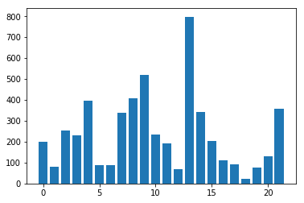

# LightGBM模型调优


```python
# 首先 import 必要的模块
import pandas as pd 
import numpy as np

import lightgbm as lgbm
from lightgbm.sklearn import LGBMClassifier

from sklearn.model_selection import GridSearchCV

import matplotlib.pyplot as plt
%matplotlib inline
```

## 读取数据


```python
# 读取数据
train = pd.read_csv("FE_train.csv")
train = train.drop(["ID"], axis=1)
train=train.fillna(0)
y_train = train['Disbursed'] 
X_train = train.drop(["Disbursed"], axis=1)
X_train.head(5)

```


<div>
<style scoped>
    .dataframe tbody tr th:only-of-type {
        vertical-align: middle;
    }

    .dataframe tbody tr th {
        vertical-align: top;
    }

    .dataframe thead th {
        text-align: right;
    }
</style>
<table border="1" class="dataframe">
  <thead>
    <tr style="text-align: right;">
      <th></th>
      <th>City</th>
      <th>Device_Type</th>
      <th>EMI_Loan_Submitted</th>
      <th>Employer_Name</th>
      <th>Existing_EMI</th>
      <th>Filled_Form</th>
      <th>Gender</th>
      <th>Interest_Rate</th>
      <th>Loan_Amount_Applied</th>
      <th>Loan_Amount_Submitted</th>
      <th>...</th>
      <th>Mobile_Verified</th>
      <th>Monthly_Income</th>
      <th>Processing_Fee</th>
      <th>Salary_Account</th>
      <th>Source</th>
      <th>Var1</th>
      <th>Var2</th>
      <th>Var4</th>
      <th>Var5</th>
      <th>Age</th>
    </tr>
  </thead>
  <tbody>
    <tr>
      <th>0</th>
      <td>15</td>
      <td>2</td>
      <td>0.0</td>
      <td>192</td>
      <td>0.0</td>
      <td>1</td>
      <td>0</td>
      <td>0.00</td>
      <td>300000.0</td>
      <td>0.0</td>
      <td>...</td>
      <td>1</td>
      <td>20000</td>
      <td>0.0</td>
      <td>15</td>
      <td>1</td>
      <td>13</td>
      <td>6</td>
      <td>1</td>
      <td>0.0</td>
      <td>37</td>
    </tr>
    <tr>
      <th>1</th>
      <td>44</td>
      <td>2</td>
      <td>6762.9</td>
      <td>227</td>
      <td>0.0</td>
      <td>1</td>
      <td>1</td>
      <td>13.25</td>
      <td>200000.0</td>
      <td>200000.0</td>
      <td>...</td>
      <td>2</td>
      <td>35000</td>
      <td>0.0</td>
      <td>17</td>
      <td>1</td>
      <td>8</td>
      <td>6</td>
      <td>3</td>
      <td>13.0</td>
      <td>30</td>
    </tr>
    <tr>
      <th>2</th>
      <td>52</td>
      <td>2</td>
      <td>0.0</td>
      <td>192</td>
      <td>0.0</td>
      <td>1</td>
      <td>1</td>
      <td>0.00</td>
      <td>600000.0</td>
      <td>450000.0</td>
      <td>...</td>
      <td>2</td>
      <td>22500</td>
      <td>0.0</td>
      <td>37</td>
      <td>9</td>
      <td>13</td>
      <td>1</td>
      <td>1</td>
      <td>0.0</td>
      <td>34</td>
    </tr>
    <tr>
      <th>3</th>
      <td>52</td>
      <td>2</td>
      <td>0.0</td>
      <td>192</td>
      <td>0.0</td>
      <td>1</td>
      <td>1</td>
      <td>0.00</td>
      <td>1000000.0</td>
      <td>920000.0</td>
      <td>...</td>
      <td>2</td>
      <td>35000</td>
      <td>0.0</td>
      <td>37</td>
      <td>9</td>
      <td>13</td>
      <td>1</td>
      <td>3</td>
      <td>10.0</td>
      <td>28</td>
    </tr>
    <tr>
      <th>4</th>
      <td>6</td>
      <td>2</td>
      <td>0.0</td>
      <td>192</td>
      <td>25000.0</td>
      <td>1</td>
      <td>1</td>
      <td>0.00</td>
      <td>500000.0</td>
      <td>500000.0</td>
      <td>...</td>
      <td>2</td>
      <td>100000</td>
      <td>0.0</td>
      <td>15</td>
      <td>6</td>
      <td>13</td>
      <td>1</td>
      <td>3</td>
      <td>17.0</td>
      <td>31</td>
    </tr>
  </tbody>
</table>
<p>5 rows × 22 columns</p>
</div>


```python

#保存特征名字以备后用（可视化）
feat_names = X_train.columns 
```

## LightGBM超参数调优

LightGBM的主要的超参包括：
1. 树的数目n_estimators 和 学习率 learning_rate
2. 树的最大深度max_depth 和 树的最大叶子节点数目num_leaves（LightGBM采用叶子优先的方式生成树，num_leaves很重要，设置成比 2^max_depth 小）
3. 叶子结点的最小样本数:min_data_in_leaf(min_data, min_child_samples)
4. 每棵树的列采样比例：feature_fraction/colsample_bytree
5. 每棵树的行采样比例：bagging_fraction （需同时设置bagging_freq=1）/subsample
6. 正则化参数lambda_l1(reg_alpha), lambda_l2(reg_lambda)

7. 两个非模型复杂度参数，但会影响模型速度和精度。可根据特征取值范围和样本数目修改这两个参数
1）特征的最大bin数目max_bin：默认255；
2）用来建立直方图的样本数目subsample_for_bin：默认200000。

对n_estimators，用LightGBM内嵌的cv函数调优，因为同XGBoost一样，LightGBM学习的过程内嵌了cv，速度极快。
其他参数用GridSearchCV


```python
MAX_ROUNDS = 10000
```

### 相同的交叉验证分组
样本数太多（87020），CV折数越多，cv性能越好。
可能是由于GBDT是很复杂的模型，其实数据越多越好（cv折数多，每次留出的样本少，参数模型训练的样本更多）


```python
# prepare cross validation
from sklearn.model_selection import StratifiedKFold

kfold = StratifiedKFold(n_splits=5, shuffle=True, random_state=3)
```

### 1. n_estimators


```python
#直接调用lightgbm内嵌的交叉验证(cv)，可对连续的n_estimators参数进行快速交叉验证
#而GridSearchCV只能对有限个参数进行交叉验证，且速度相对较慢
def get_n_estimators(params , X_train , y_train , early_stopping_rounds=10):
    lgbm_params = params.copy()
     
    lgbmtrain = lgbm.Dataset(X_train , y_train )
     
    #num_boost_round为弱分类器数目，下面的代码参数里因为已经设置了early_stopping_rounds
    #即性能未提升的次数超过过早停止设置的数值，则停止训练
    cv_result = lgbm.cv(lgbm_params , lgbmtrain , num_boost_round=MAX_ROUNDS , nfold=5,  metrics='auc' , early_stopping_rounds=early_stopping_rounds,seed=3 )
     
    print('best n_estimators:' , len(cv_result['auc-mean']))
    print('best cv score:' , cv_result['auc-mean'][-1])
     
    return len(cv_result['auc-mean'])
```


```python
params = {'boosting_type': 'goss',
          'objective': 'binary',
          'is_unbalance':True,
          #'categorical_feature': names:'City', 'Employer_Name', 'Salary_Account','Device_Type','Filled_Form','Gender','Mobile_Verified','Source','Var1','Var2','Var4',
          'categorical_feature': [0,1,3,5,6,12,15,16,17,18,19,20],
          'n_jobs': 4,
          'learning_rate': 0.1,
          #'n_estimators':n_estimators_1,
          'num_leaves': 60,
          'max_depth': 6,
          'colsample_bytree': 0.7,
          'verbosity':5
         }

#categorical_feature = ['City', 'Employer_Name', 'Salary_Account','Device_Type','Filled_Form','Gender','Mobile_Verified','Source','Var1','Var2','Var4']
n_estimators_1 = get_n_estimators(params, X_train , y_train)
```

    d:\ProgramData\Anaconda3\lib\site-packages\lightgbm\basic.py:721: UserWarning: categorical_feature keyword has been found in `params` and will be ignored.
    Please use categorical_feature argument of the Dataset constructor to pass this parameter.
      .format(key))


    best n_estimators: 54
    best cv score: 0.821749537474272


### 2. num_leaves & max_depth=7
num_leaves建议70-80，搜索区间50-80,值越大模型越复杂，越容易过拟合
相应的扩大max_depth=7


```python
params = {'boosting_type': 'goss',
          'objective': 'binary',
          'is_unbalance':True,
          'categorical_feature': [0,1,3,5,6,12,15,16,17,18,19,20],
          'n_jobs': 4,
          'learning_rate': 0.1,
          'n_estimators':n_estimators_1,
          #'num_leaves': 60,
          'max_depth': 6,
          'colsample_bytree': 0.7,
         }
lg = LGBMClassifier(silent=False,  **params)

num_leaves_s = range(50,90,10) #50,60,70,80
tuned_parameters = dict( num_leaves = num_leaves_s)

grid_search = GridSearchCV(lg, n_jobs=4, param_grid=tuned_parameters, cv = kfold, scoring="roc_auc", verbose=5, refit = False)
grid_search.fit(X_train , y_train)
#grid_search.best_estimator_
```

    Fitting 5 folds for each of 4 candidates, totalling 20 fits


    [Parallel(n_jobs=4)]: Using backend LokyBackend with 4 concurrent workers.
    [Parallel(n_jobs=4)]: Done  10 tasks      | elapsed:    3.7s
    [Parallel(n_jobs=4)]: Done  18 out of  20 | elapsed:    5.8s remaining:    0.6s
    [Parallel(n_jobs=4)]: Done  20 out of  20 | elapsed:    6.1s finished


    GridSearchCV(cv=StratifiedKFold(n_splits=5, random_state=3, shuffle=True),
           error_score='raise-deprecating',
           estimator=LGBMClassifier(boosting_type='goss',
            categorical_feature=[0, 1, 3, 5, 6, 12, 15, 16, 17, 18, 19, 20],
            class_weight=None, colsample_bytree=0.7, importance_type='split',
            is_unbalance=True, learning_rate=0.1, max_depth=6,
            min_child_samples=20, min_child_weight=....0, reg_lambda=0.0, silent=False,
            subsample=1.0, subsample_for_bin=200000, subsample_freq=0),
           fit_params=None, iid='warn', n_jobs=4,
           param_grid={'num_leaves': range(50, 90, 10)},
           pre_dispatch='2*n_jobs', refit=False, return_train_score='warn',
           scoring='roc_auc', verbose=5)


```python
# examine the best model
print(grid_search.best_score_)
print(grid_search.best_params_)
```

    0.82442980948178
    {'num_leaves': 70}


```python
# plot CV误差曲线
test_means = grid_search.cv_results_[ 'mean_test_score' ]
test_stds = grid_search.cv_results_[ 'std_test_score' ]
train_means = grid_search.cv_results_[ 'mean_train_score' ]
train_stds = grid_search.cv_results_[ 'std_train_score' ]

n_leafs = len(num_leaves_s)

x_axis = num_leaves_s
plt.plot(x_axis, test_means)
#plt.errorbar(x_axis, -test_means, yerr=test_stds,label = ' Test')
#plt.errorbar(x_axis, -train_means, yerr=train_stds,label = ' Train')
plt.xlabel( 'num_leaves' )
plt.ylabel( 'AUC' )
plt.show()
```

    d:\ProgramData\Anaconda3\lib\site-packages\sklearn\utils\deprecation.py:125: FutureWarning: You are accessing a training score ('mean_train_score'), which will not be available by default any more in 0.21. If you need training scores, please set return_train_score=True
      warnings.warn(*warn_args, **warn_kwargs)
    d:\ProgramData\Anaconda3\lib\site-packages\sklearn\utils\deprecation.py:125: FutureWarning: You are accessing a training score ('std_train_score'), which will not be available by default any more in 0.21. If you need training scores, please set return_train_score=True
      warnings.warn(*warn_args, **warn_kwargs)


```python
test_means
```


    array([0.82313902, 0.82388894, 0.82442981, 0.82442981])


#### 性能抖动，取系统推荐值：70

### 3. min_child_samples
叶子节点的最小样本数目

叶子节点数目：70，共2类，平均每类35个叶子节点
每棵树的样本数目数目最少的类（稀有事件）的样本数目：8w * 4/5 * 1.4% = 840
所以每个叶子节点约840/35 = 25个样本点

搜索范围：10-50


```python
params = {'boosting_type': 'goss',
          'objective': 'binary',
          'is_unbalance':True,
          'categorical_feature': [0,1,3,5,6,12,15,16,17,18,19,20],
          'n_jobs': 4,
          'learning_rate': 0.1,
          'n_estimators':n_estimators_1,
          'num_leaves': 70,
          'max_depth': 6,
          'colsample_bytree': 0.7,
         }
lg = LGBMClassifier(silent=False,  **params)

min_child_samples_s = range(10,50,10) 
tuned_parameters = dict( min_child_samples = min_child_samples_s)

grid_search = GridSearchCV(lg, n_jobs=4,  param_grid=tuned_parameters, cv = kfold, scoring="roc_auc", verbose=5, refit = False)
grid_search.fit(X_train , y_train)
```

    [Parallel(n_jobs=4)]: Using backend LokyBackend with 4 concurrent workers.


    Fitting 5 folds for each of 4 candidates, totalling 20 fits


    [Parallel(n_jobs=4)]: Done  10 tasks      | elapsed:    2.8s
    [Parallel(n_jobs=4)]: Done  18 out of  20 | elapsed:    4.7s remaining:    0.4s
    [Parallel(n_jobs=4)]: Done  20 out of  20 | elapsed:    4.8s finished


    GridSearchCV(cv=StratifiedKFold(n_splits=5, random_state=3, shuffle=True),
           error_score='raise-deprecating',
           estimator=LGBMClassifier(boosting_type='goss',
            categorical_feature=[0, 1, 3, 5, 6, 12, 15, 16, 17, 18, 19, 20],
            class_weight=None, colsample_bytree=0.7, importance_type='split',
            is_unbalance=True, learning_rate=0.1, max_depth=6,
            min_child_samples=20, min_child_weight=....0, reg_lambda=0.0, silent=False,
            subsample=1.0, subsample_for_bin=200000, subsample_freq=0),
           fit_params=None, iid='warn', n_jobs=4,
           param_grid={'min_child_samples': range(10, 50, 10)},
           pre_dispatch='2*n_jobs', refit=False, return_train_score='warn',
           scoring='roc_auc', verbose=5)


```python
# examine the best model
print(grid_search.best_score_)
print(grid_search.best_params_)
```

    0.8250826902190417
    {'min_child_samples': 40}


```python
# plot CV误差曲线
test_means = grid_search.cv_results_[ 'mean_test_score' ]
test_stds = grid_search.cv_results_[ 'std_test_score' ]
train_means = grid_search.cv_results_[ 'mean_train_score' ]
train_stds = grid_search.cv_results_[ 'std_train_score' ]

x_axis = min_child_samples_s

plt.plot(x_axis, test_means)
#plt.errorbar(x_axis, -test_scores, yerr=test_stds ,label = ' Test')
#plt.errorbar(x_axis, -train_scores, yerr=train_stds,label =  +' Train')

plt.show()
```

    d:\ProgramData\Anaconda3\lib\site-packages\sklearn\utils\deprecation.py:125: FutureWarning: You are accessing a training score ('mean_train_score'), which will not be available by default any more in 0.21. If you need training scores, please set return_train_score=True
      warnings.warn(*warn_args, **warn_kwargs)
    d:\ProgramData\Anaconda3\lib\site-packages\sklearn\utils\deprecation.py:125: FutureWarning: You are accessing a training score ('std_train_score'), which will not be available by default any more in 0.21. If you need training scores, please set return_train_score=True
      warnings.warn(*warn_args, **warn_kwargs)


```python
test_means
```


    array([0.82200411, 0.82442981, 0.82285826, 0.82508269])


#### 再次细调


```python
params = {'boosting_type': 'goss',
          'objective': 'binary',
          'is_unbalance':True,
          'categorical_feature': [0,1,3,5,6,12,15,16,17,18,19,20],
          'n_jobs': 4,
          'learning_rate': 0.1,
          'n_estimators':n_estimators_1,
          'num_leaves': 70,
          'max_depth': 6,
          'colsample_bytree': 0.7,
         }
lg = LGBMClassifier(silent=False,  **params)

min_child_samples_s = range(40,60,10) 
tuned_parameters = dict( min_child_samples = min_child_samples_s)

grid_search = GridSearchCV(lg, n_jobs=4,  param_grid=tuned_parameters, cv = kfold, scoring="roc_auc", verbose=5, refit = False)
grid_search.fit(X_train , y_train)
```

    Fitting 5 folds for each of 2 candidates, totalling 10 fits


    [Parallel(n_jobs=4)]: Using backend LokyBackend with 4 concurrent workers.
    [Parallel(n_jobs=4)]: Done   6 out of  10 | elapsed:    1.8s remaining:    1.2s
    [Parallel(n_jobs=4)]: Done  10 out of  10 | elapsed:    2.4s finished


    GridSearchCV(cv=StratifiedKFold(n_splits=5, random_state=3, shuffle=True),
           error_score='raise-deprecating',
           estimator=LGBMClassifier(boosting_type='goss',
            categorical_feature=[0, 1, 3, 5, 6, 12, 15, 16, 17, 18, 19, 20],
            class_weight=None, colsample_bytree=0.7, importance_type='split',
            is_unbalance=True, learning_rate=0.1, max_depth=6,
            min_child_samples=20, min_child_weight=....0, reg_lambda=0.0, silent=False,
            subsample=1.0, subsample_for_bin=200000, subsample_freq=0),
           fit_params=None, iid='warn', n_jobs=4,
           param_grid={'min_child_samples': range(40, 60, 10)},
           pre_dispatch='2*n_jobs', refit=False, return_train_score='warn',
           scoring='roc_auc', verbose=5)


```python
# examine the best model
print(grid_search.best_score_)
print(grid_search.best_params_)
```

    0.8250826902190417
    {'min_child_samples': 40}


```python
# plot CV误差曲线
test_means = grid_search.cv_results_[ 'mean_test_score' ]
test_stds = grid_search.cv_results_[ 'std_test_score' ]
train_means = grid_search.cv_results_[ 'mean_train_score' ]
train_stds = grid_search.cv_results_[ 'std_train_score' ]

x_axis = min_child_samples_s

plt.plot(x_axis, test_means)
#plt.errorbar(x_axis, -test_scores, yerr=test_stds ,label = ' Test')
#plt.errorbar(x_axis, -train_scores, yerr=train_stds,label =  +' Train')

plt.show()
```

    d:\ProgramData\Anaconda3\lib\site-packages\sklearn\utils\deprecation.py:125: FutureWarning: You are accessing a training score ('mean_train_score'), which will not be available by default any more in 0.21. If you need training scores, please set return_train_score=True
      warnings.warn(*warn_args, **warn_kwargs)
    d:\ProgramData\Anaconda3\lib\site-packages\sklearn\utils\deprecation.py:125: FutureWarning: You are accessing a training score ('std_train_score'), which will not be available by default any more in 0.21. If you need training scores, please set return_train_score=True
      warnings.warn(*warn_args, **warn_kwargs)


#### min_child_samples=40

### 列采样参数 sub_feature/feature_fraction/colsample_bytree


```python
params = {'boosting_type': 'goss',
          'objective': 'binary',
          'is_unbalance':True,
          'categorical_feature': [0,1,3,5,6,12,15,16,17,18,19,20],
          'n_jobs': 4,
          'learning_rate': 0.1,
          'n_estimators':n_estimators_1,
          'num_leaves': 70,
          'max_depth': 6,
          'min_child_samples':40
          #'colsample_bytree': 0.7,
         }
lg = LGBMClassifier(silent=False,  **params)

colsample_bytree_s = [i/10.0 for i in range(5,10)]
tuned_parameters = dict( colsample_bytree = colsample_bytree_s)

grid_search = GridSearchCV(lg, n_jobs=4,  param_grid=tuned_parameters, cv = kfold, scoring="roc_auc", verbose=5, refit = False)
grid_search.fit(X_train , y_train)
#grid_search.best_estimator_
```

    [Parallel(n_jobs=4)]: Using backend LokyBackend with 4 concurrent workers.


    Fitting 5 folds for each of 5 candidates, totalling 25 fits


    [Parallel(n_jobs=4)]: Done  10 tasks      | elapsed:    2.7s
    [Parallel(n_jobs=4)]: Done  25 out of  25 | elapsed:    6.1s finished


    GridSearchCV(cv=StratifiedKFold(n_splits=5, random_state=3, shuffle=True),
           error_score='raise-deprecating',
           estimator=LGBMClassifier(boosting_type='goss',
            categorical_feature=[0, 1, 3, 5, 6, 12, 15, 16, 17, 18, 19, 20],
            class_weight=None, colsample_bytree=1.0, importance_type='split',
            is_unbalance=True, learning_rate=0.1, max_depth=6,
            min_child_samples=40, min_child_weight=....0, reg_lambda=0.0, silent=False,
            subsample=1.0, subsample_for_bin=200000, subsample_freq=0),
           fit_params=None, iid='warn', n_jobs=4,
           param_grid={'colsample_bytree': [0.5, 0.6, 0.7, 0.8, 0.9]},
           pre_dispatch='2*n_jobs', refit=False, return_train_score='warn',
           scoring='roc_auc', verbose=5)


```python
# examine the best model
print(grid_search.best_score_)
print(grid_search.best_params_)
```

    0.8253560738615162
    {'colsample_bytree': 0.5}


```python
# plot CV误差曲线
test_means = grid_search.cv_results_[ 'mean_test_score' ]
test_stds = grid_search.cv_results_[ 'std_test_score' ]
train_means = grid_search.cv_results_[ 'mean_train_score' ]
train_stds = grid_search.cv_results_[ 'std_train_score' ]

x_axis = colsample_bytree_s

plt.plot(x_axis, test_means)
#plt.errorbar(x_axis, -test_scores[:,i], yerr=test_stds[:,i] ,label = str(max_depths[i]) +' Test')
#plt.errorbar(x_axis, -train_scores[:,i], yerr=train_stds[:,i] ,label = str(max_depths[i]) +' Train')

plt.show()
```

    d:\ProgramData\Anaconda3\lib\site-packages\sklearn\utils\deprecation.py:125: FutureWarning: You are accessing a training score ('mean_train_score'), which will not be available by default any more in 0.21. If you need training scores, please set return_train_score=True
      warnings.warn(*warn_args, **warn_kwargs)
    d:\ProgramData\Anaconda3\lib\site-packages\sklearn\utils\deprecation.py:125: FutureWarning: You are accessing a training score ('std_train_score'), which will not be available by default any more in 0.21. If you need training scores, please set return_train_score=True
      warnings.warn(*warn_args, **warn_kwargs)


再调小一点


```python
params = {'boosting_type': 'goss',
          'objective': 'binary',
          'is_unbalance':True,
          'categorical_feature': [0,1,3,5,6,12,15,16,17,18,19,20],
          'n_jobs': 4,
          'learning_rate': 0.1,
          'n_estimators':n_estimators_1,
          'num_leaves': 70,
          'max_depth': 6,
          'min_child_samples':40
          #'colsample_bytree': 0.7,
         }
lg = LGBMClassifier(silent=False,  **params)

colsample_bytree_s = [i/10.0 for i in range(3,6)]
tuned_parameters = dict( colsample_bytree = colsample_bytree_s)

grid_search = GridSearchCV(lg, n_jobs=4,  param_grid=tuned_parameters, cv = kfold, scoring="roc_auc", verbose=5, refit = False)
grid_search.fit(X_train , y_train)
#grid_search.best_estimator_
```

    [Parallel(n_jobs=4)]: Using backend LokyBackend with 4 concurrent workers.


    Fitting 5 folds for each of 3 candidates, totalling 15 fits


    [Parallel(n_jobs=4)]: Done  12 out of  15 | elapsed:    2.9s remaining:    0.7s
    [Parallel(n_jobs=4)]: Done  15 out of  15 | elapsed:    3.5s finished


    GridSearchCV(cv=StratifiedKFold(n_splits=5, random_state=3, shuffle=True),
           error_score='raise-deprecating',
           estimator=LGBMClassifier(boosting_type='goss',
            categorical_feature=[0, 1, 3, 5, 6, 12, 15, 16, 17, 18, 19, 20],
            class_weight=None, colsample_bytree=1.0, importance_type='split',
            is_unbalance=True, learning_rate=0.1, max_depth=6,
            min_child_samples=40, min_child_weight=....0, reg_lambda=0.0, silent=False,
            subsample=1.0, subsample_for_bin=200000, subsample_freq=0),
           fit_params=None, iid='warn', n_jobs=4,
           param_grid={'colsample_bytree': [0.3, 0.4, 0.5]},
           pre_dispatch='2*n_jobs', refit=False, return_train_score='warn',
           scoring='roc_auc', verbose=5)


```python
# examine the best model
print(grid_search.best_score_)
print(grid_search.best_params_)
```

    0.8269420542219359
    {'colsample_bytree': 0.4}


#### colsample_bytree=0.4

### 正则化参数lambda_l1(reg_alpha), lambda_l2(reg_lambda)感觉不用调了

### 减小学习率，调整n_estimators


```python
params = {'boosting_type': 'goss',
          'objective': 'binary',
          'is_unbalance':True,
          'categorical_feature': [0,1,3,5,6,12,15,16,17,18,19,20],
          'n_jobs': 4,
          'learning_rate': 0.01,
          #'n_estimators':n_estimators_1,
          'num_leaves': 70,
          'max_depth': 6,
          'min_child_samples':40,
          'colsample_bytree': 0.4
         }
n_estimators_2 = get_n_estimators(params , X_train , y_train, early_stopping_rounds=50)
```

    d:\ProgramData\Anaconda3\lib\site-packages\lightgbm\basic.py:721: UserWarning: categorical_feature keyword has been found in `params` and will be ignored.
    Please use categorical_feature argument of the Dataset constructor to pass this parameter.
      .format(key))


    best n_estimators: 524
    best cv score: 0.8473647982165338


### 用所有训练数据，采用最佳参数重新训练模型
由于样本数目增多，模型复杂度稍微扩大一点？
num_leaves增多5
#min_child_samples按样本比例增加到15


```python
params = {'boosting_type': 'goss',
          'objective': 'binary',
          'is_unbalance':True,
          'categorical_feature': [0,1,3,5,6,12,15,16,17,18,19,20],
          'n_jobs': 4,
          'learning_rate': 0.01,
          #'n_estimators':n_estimators_1,
          'num_leaves': 75,
          'max_depth': 6,
          'min_child_samples':40,
          'colsample_bytree': 0.4
         }

lg = LGBMClassifier(silent=False,  **params)
lg.fit(X_train, y_train)
```

    d:\ProgramData\Anaconda3\lib\site-packages\lightgbm\basic.py:721: UserWarning: categorical_feature keyword has been found in `params` and will be ignored.
    Please use categorical_feature argument of the Dataset constructor to pass this parameter.
      .format(key))


    LGBMClassifier(boosting_type='goss',
            categorical_feature=[0, 1, 3, 5, 6, 12, 15, 16, 17, 18, 19, 20],
            class_weight=None, colsample_bytree=0.4, importance_type='split',
            is_unbalance=True, learning_rate=0.01, max_depth=6,
            min_child_samples=40, min_child_weight=0.001, min_split_gain=0.0,
            n_estimators=100, n_jobs=4, num_leaves=75, objective='binary',
            random_state=None, reg_alpha=0.0, reg_lambda=0.0, silent=False,
            subsample=1.0, subsample_for_bin=200000, subsample_freq=0)


## 保存模型，用于后续测试


```python
import pickle

pickle.dump(lg, open("HappyBank_LightGBM_.pkl", 'wb'))
```

### 特征重要性


```python
df = pd.DataFrame({"columns":list(feat_names), "importance":list(lg.feature_importances_.T)})
df = df.sort_values(by=['importance'],ascending=False)
```


```python
df
```


<div>
<style scoped>
    .dataframe tbody tr th:only-of-type {
        vertical-align: middle;
    }

    .dataframe tbody tr th {
        vertical-align: top;
    }

    .dataframe thead th {
        text-align: right;
    }
</style>
<table border="1" class="dataframe">
  <thead>
    <tr style="text-align: right;">
      <th></th>
      <th>columns</th>
      <th>importance</th>
    </tr>
  </thead>
  <tbody>
    <tr>
      <th>13</th>
      <td>Monthly_Income</td>
      <td>798</td>
    </tr>
    <tr>
      <th>9</th>
      <td>Loan_Amount_Submitted</td>
      <td>518</td>
    </tr>
    <tr>
      <th>8</th>
      <td>Loan_Amount_Applied</td>
      <td>409</td>
    </tr>
    <tr>
      <th>4</th>
      <td>Existing_EMI</td>
      <td>396</td>
    </tr>
    <tr>
      <th>21</th>
      <td>Age</td>
      <td>357</td>
    </tr>
    <tr>
      <th>14</th>
      <td>Processing_Fee</td>
      <td>344</td>
    </tr>
    <tr>
      <th>7</th>
      <td>Interest_Rate</td>
      <td>339</td>
    </tr>
    <tr>
      <th>2</th>
      <td>EMI_Loan_Submitted</td>
      <td>253</td>
    </tr>
    <tr>
      <th>10</th>
      <td>Loan_Tenure_Applied</td>
      <td>235</td>
    </tr>
    <tr>
      <th>3</th>
      <td>Employer_Name</td>
      <td>230</td>
    </tr>
    <tr>
      <th>15</th>
      <td>Salary_Account</td>
      <td>202</td>
    </tr>
    <tr>
      <th>0</th>
      <td>City</td>
      <td>200</td>
    </tr>
    <tr>
      <th>11</th>
      <td>Loan_Tenure_Submitted</td>
      <td>192</td>
    </tr>
    <tr>
      <th>20</th>
      <td>Var5</td>
      <td>129</td>
    </tr>
    <tr>
      <th>16</th>
      <td>Source</td>
      <td>110</td>
    </tr>
    <tr>
      <th>17</th>
      <td>Var1</td>
      <td>91</td>
    </tr>
    <tr>
      <th>6</th>
      <td>Gender</td>
      <td>89</td>
    </tr>
    <tr>
      <th>5</th>
      <td>Filled_Form</td>
      <td>86</td>
    </tr>
    <tr>
      <th>1</th>
      <td>Device_Type</td>
      <td>82</td>
    </tr>
    <tr>
      <th>19</th>
      <td>Var4</td>
      <td>76</td>
    </tr>
    <tr>
      <th>12</th>
      <td>Mobile_Verified</td>
      <td>67</td>
    </tr>
    <tr>
      <th>18</th>
      <td>Var2</td>
      <td>23</td>
    </tr>
  </tbody>
</table>
</div>


```python
plt.bar(range(len(lg.feature_importances_)), lg.feature_importances_)
plt.show()
```





```python

```
